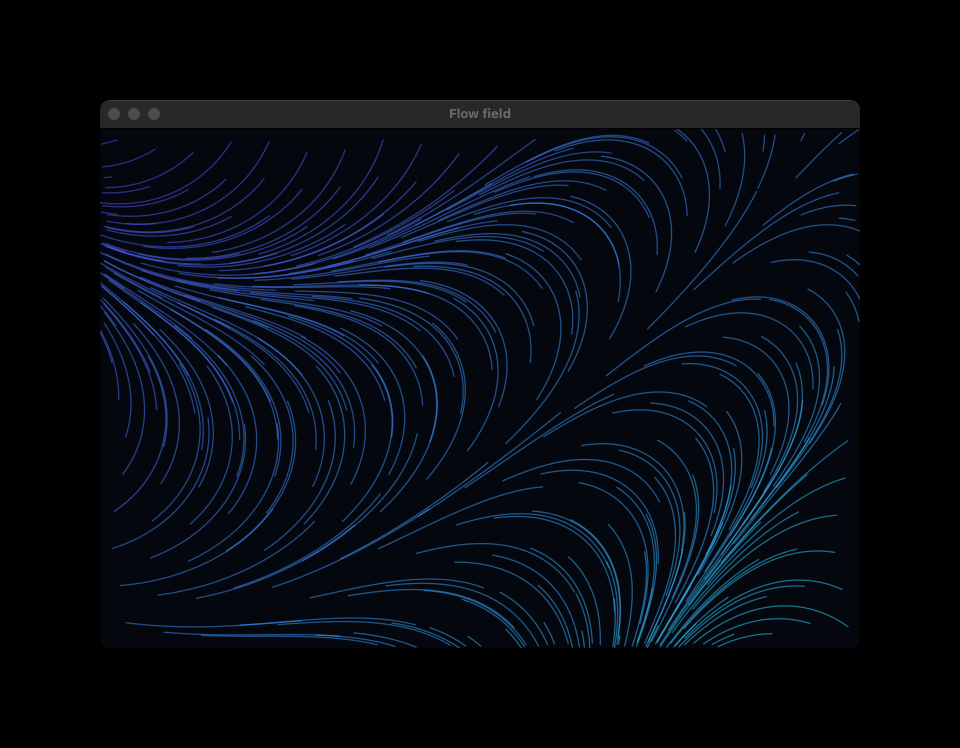
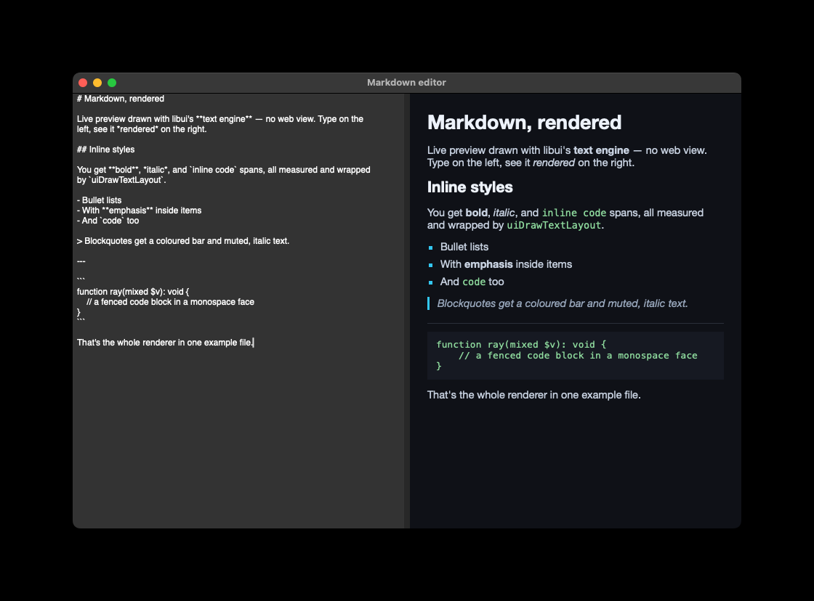
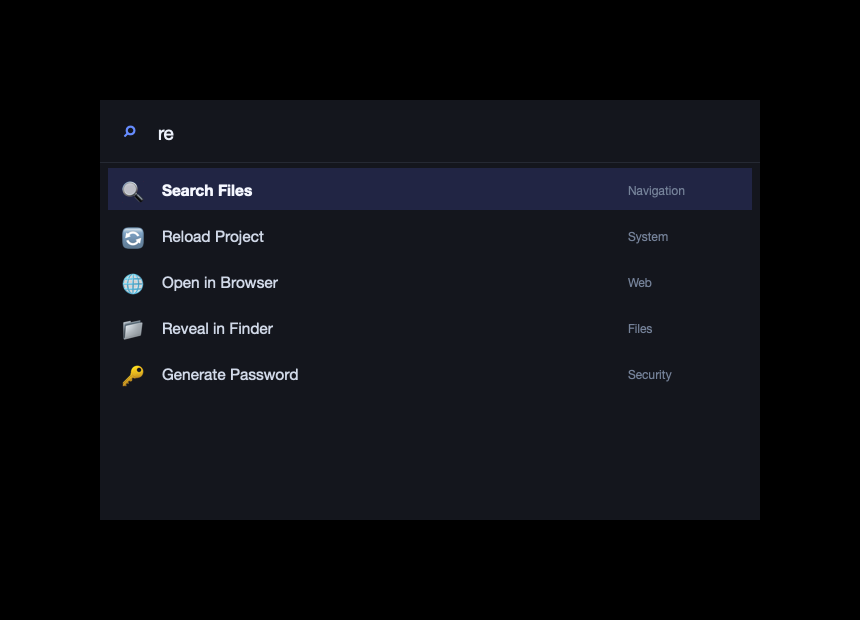
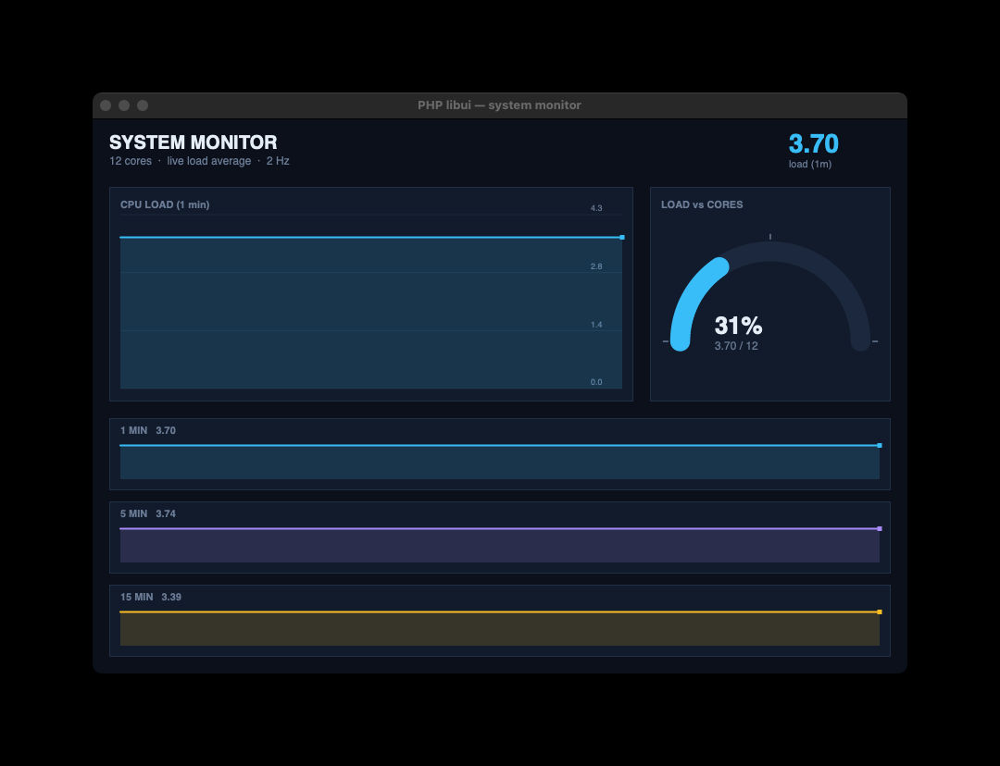
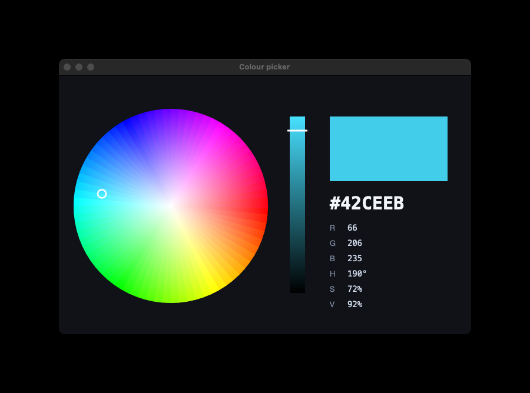

# Libui for PHP

> Native desktop GUIs in PHP — a typed, object-oriented binding to
> [`libui-ng`](https://github.com/libui-ng/libui-ng) driven by PHP's built-in
> **FFI**. Real native windows, widgets, dialogs, 2D drawing and text. No
> compiled PHP extension, no C toolchain on the user's machine.

[](https://github.com/HelgeSverre/libui/actions/workflows/ci.yml)
[](https://packagist.org/packages/helgesverre/libui)


<p align="center">
  
  
</p>

## Install

```sh
composer require helgesverre/libui
```

Requires **PHP 8.5** with the **FFI** extension (enabled by default on the CLI).
On macOS a prebuilt universal `libui` ships inside the package — there's nothing
else to install. Linux and Windows need a `libui` shared library for your
platform; see [Platform support](#platform-support).

## Quick start

```php
<?php

require 'vendor/autoload.php';

use Libui\Ffi;
use Libui\Window;
use Libui\Box;
use Libui\Entry;
use Libui\Button;

Ffi::init();

$entry  = new Entry();
$button = (new Button('Greet'))->onClicked(fn () => print("Hi, {$entry->text()}!\n"));

(new Window('Greeter'))
    ->setChild(
        (new Box(padded: true))
            ->append($entry)
            ->append($button),
    )
    ->run();
```

`Window::run()` shows the window, runs the event loop, and tears everything down
when it closes — so a single-window app is one call. For multiple windows or an
app-level quit handler, use the `App` facade:

```php
use Libui\App;

App::new()
    ->window($mainWindow)
    ->onShouldQuit(fn () => $document->isSaved())
    ->run();
```

Every widget is a typed class with fluent setters and IDE autocompletion
(`$slider->setValue(50)`, `$entry->text()`, `$button->onClicked(...)`), so you
can discover the API as you type.

## What you can build

<table>
  <tr>
    <td width="33%"><br><b>Generative art</b> — thousands of streamlines through an animated vector field.</td>
    <td width="33%"><br><b>Command palette</b> — a borderless Raycast-style launcher; fuzzy search + keyboard nav, all custom-drawn.</td>
    <td width="33%"><br><b>Live dashboard</b> — CPU charts, a gauge and sparklines from real load data.</td>
  </tr>
  <tr>
    <td><br><b>Markdown editor</b> — a live rich-rendered preview, drawn with the text engine (no web view).</td>
    <td><br><b>Colour picker</b> — an HSV wheel of arc wedges with a live swatch and hex/RGB readouts.</td>
    <td><br><b>Widgets</b> — tabs, forms, sliders, spinboxes, combos, date &amp; colour pickers.</td>
  </tr>
</table>

…plus 2D drawing, data grids, attributed text, timer animation, and native
menus &amp; dialogs. All the runnable sources are in [`examples/`](examples/) —
see [Development](#development) to run them.

## Features

- **23 typed widget classes** — windows, boxes, forms, grids, tabs, groups,
  buttons, checkboxes, radio buttons, entries (plain/password/search), multiline
  entries, labels, spinboxes, sliders, progress bars, combos, editable combos,
  date/time pickers, colour & font buttons, separators, menus and menu items.
- **19 PHP enums + bit-flags** (`Align`, `TextWeight`, `DrawFillMode`, …),
  generated 1:1 from libui's C enums.
- **Native dialogs** — message boxes and open/save/folder pickers.
- **Custom 2D drawing** — vector `Path`s, solid/gradient `Brush`es,
  `StrokeParams`, affine `Matrix`, clipping, and a `DrawContext` to draw into.
- **Attributed text** — `AttributedString` with per-range colour/weight/italic/
  underline attributes, a `FontDescriptor`, and a drawable `TextLayout`.
- **Data-grid table** — `Table` backed by a `TableModelDelegate` you implement.
- **Event loop helpers** — `queueMain()`, `timer()`, `onShouldQuit()`.
- **All 299 libui functions callable** — anything without a sugar wrapper is
  still reachable raw via `Ffi::get()->ui…()`.

## Platform support

The loader resolves the right binary for the current OS + architecture from
`lib/<platform>/`, overridable with the `$LIBUI_LIB` environment variable.

| Platform | Status | Notes |
|---|---|---|
| **macOS** (arm64 + x86_64) | Prebuilt, ships in the package | Universal `lib/darwin/libui.dylib`; works out of the box. |
| **Linux** (x86_64 / aarch64) | Build it | Needs **GTK 3** at runtime; build `libui.so` (see [Development](#development)) and point `$LIBUI_LIB` at it. |
| **Windows** (x86_64) | Build it | Build `libui.dll` and point `$LIBUI_LIB` at it. |

## Why not the `ext-ui` from php.net?

The PHP manual still documents a [UI extension](https://www.php.net/manual/en/book.ui.php)
(`pecl/ui`). It is **abandoned and PHP 7-only**: the last release is `2.0.0`
(July 2018), its C targets PHP 7's Zend API so it won't compile on PHP 8.x, and
`pecl install ui` fails at `configure` on a modern machine. This package reaches
the same goal a different way — it loads the maintained `libui-ng` library at
runtime and calls it through FFI, so there's no extension to compile.

## Coverage & limits

- **All 299 libui functions** are callable (raw, via `Ffi::get()->ui…()`).
- **23 of 26 widget types** have typed classes. The other three are hand-written:
  `uiControl` is the base class, `uiArea` is the drawing adapter, and `uiTable`
  is the data grid.
- Custom drawing covers paths, gradients, stroking, clipping and transforms;
  attributed text has a full sugar layer.
- Still raw-only (no sugar yet): editable / checkbox / image / progress / button
  **table columns**, table selection and row callbacks, image/OpenGL areas, and
  the less-common drawing primitives (arcs/béziers).

---

## Development

For working on the library itself — clone it, build the native library, and run
the tests:

```sh
git clone https://github.com/HelgeSverre/libui
cd libui
composer install
composer build-lib   # build lib/<platform>/libui.* from libui-ng
```

`build-lib` needs `meson` + `ninja` (`brew install meson ninja`), plus the
**GTK 3** dev headers on Linux (`apt install libgtk-3-dev`). On macOS the
prebuilt dylib is already committed, so this is only needed to refresh it.

### Run the examples

```sh
# Showcase
php examples/flowfield.php  # generative flow field (animated)
php examples/palette.php    # borderless Raycast-style command palette
php examples/monitor.php    # live system-monitor dashboard
php examples/markdown.php   # markdown editor + live rendered preview
php examples/colorpicker.php # an HSV colour wheel + picker

# Basics
php examples/form.php       # the greeter form
php examples/gallery.php    # the widget gallery (tabs of controls)
php examples/canvas.php     # custom 2D drawing — click-drag to paint
php examples/clock.php      # a timer-animated analogue clock
php examples/table.php      # a data grid
php examples/text.php       # attributed text
php examples/menu.php       # a menubar wired to dialogs
```

### Composer scripts

```sh
composer test        # the full PHPUnit suite
composer gate        # @group gate — FFI::cdef accepts the generated header
composer smoke       # @group smoke — construct widgets, no event loop
composer stan        # PHPStan (level 6)
composer format      # Mago formatter
composer lint        # Mago linter
composer regen       # regenerate src/Native/libui.gen.h + src/Generated/** from ui.h
composer build-lib   # (re)build the native library
```

### How it's built

A single generator parses libui-ng's `ui.h` (299 functions, ~98% regular naming)
**once** and emits both the FFI header and the typed OO classes — "one parse,
three tiers":

```
tools/generate.php  ──parses third_party/libui-ng/ui.h──▶
  src/Native/libui.gen.h      cleaned header, all 299 fns callable   (generated)
  src/Generated/<Widget>.php   23 typed widget classes               (generated)
  src/Generated/Enum/*.php      19 PHP enums + Flags/Modifiers        (generated)
  src/Generated/Ui.php          dialog facade (msgBox, openFile, …)   (generated)
  src/<Widget>.php              hand-editable sugar (extends Generated\<Widget>)
hand-written runtime + hard subsystems (never regenerated):
  src/Ffi.php  src/Control.php           singleton FFI, base class, callback retention
  src/Area.php src/Draw/*  src/Text/*    custom-draw surface + paths/brushes/text
  src/Table.php src/TableModel*.php       data grid (uiTableModelHandler vtable)
```

`tools/annotations.php` carries the ~2% the convention can't express. For the
full design — the header transform, the runtime FFI rules, and the
generated-vs-hand-written split — see **[docs/ARCHITECTURE.md](docs/ARCHITECTURE.md)**
and **[CONTRIBUTING.md](CONTRIBUTING.md)**.

## License

MIT — see [LICENSE](LICENSE). Bundles [libui-ng](https://github.com/libui-ng/libui-ng)
(MIT); see [THIRD_PARTY.md](THIRD_PARTY.md).
