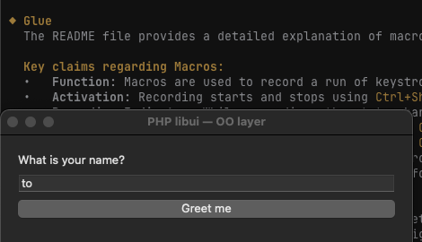
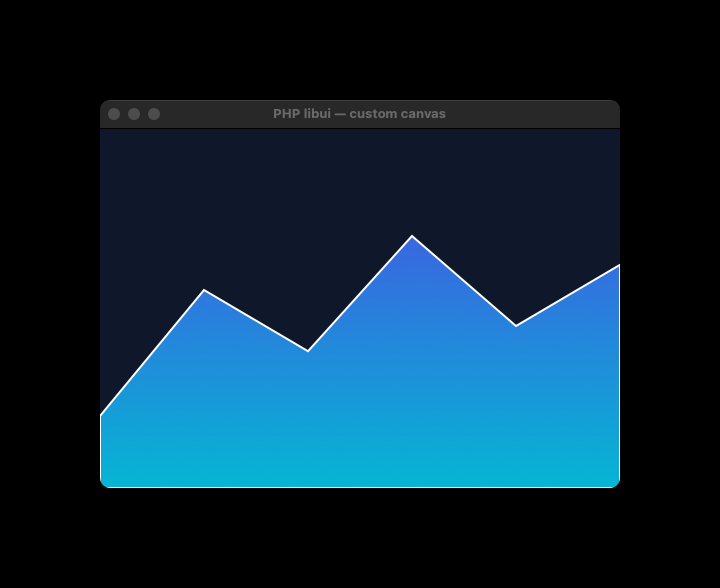
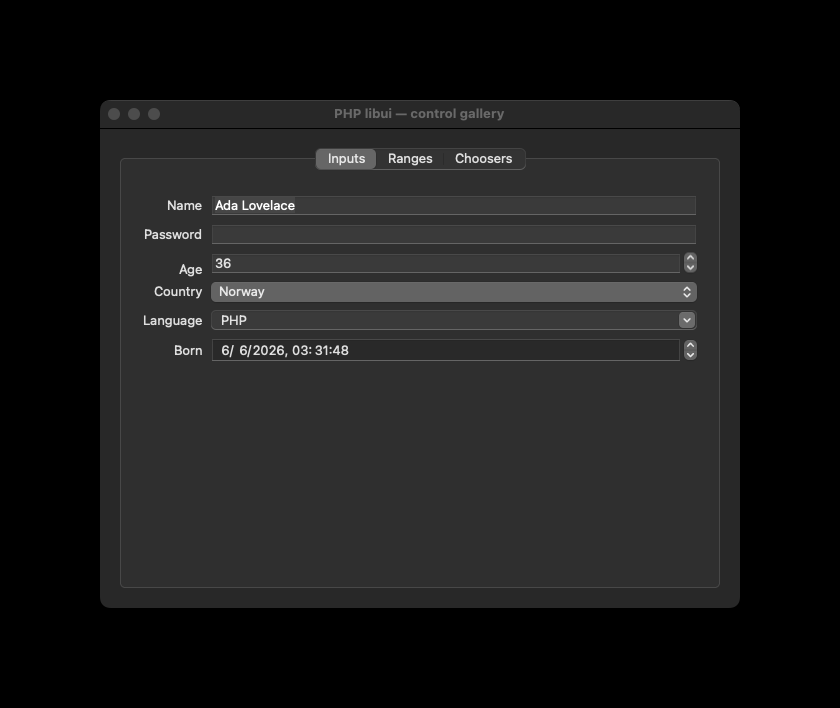
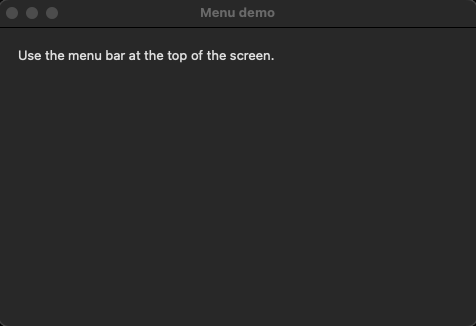
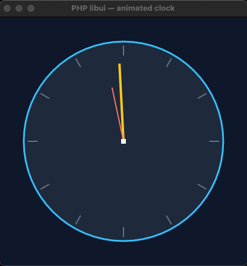
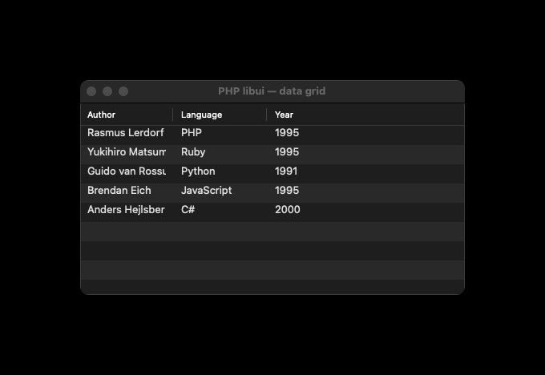
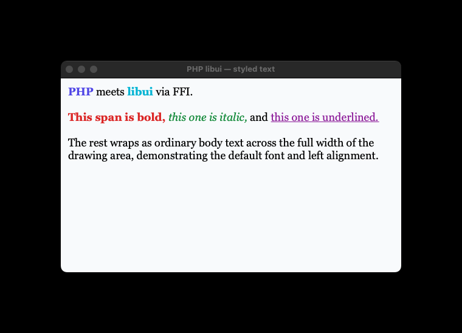

# Libui for PHP — native desktop GUI via libui-ng + FFI

A typed, object-oriented PHP binding for [`libui-ng`](https://github.com/libui-ng/libui-ng),
generated from the C header and driven through PHP 8.5's built-in **FFI**. Real
native windows, widgets, menus, dialogs, custom 2D drawing and attributed text —
no compiled PHP extension, no C toolchain on the user's machine.

| Form widgets (generated OO layer) | Custom 2D drawing (hand-written adapter) |
|---|---|
|  |  |

```php
use Libui\{Ffi, Window, Box, Entry, Button};

Ffi::init();
$window = new Window('Hello', 460, 200, false);
$box    = (new Box())->setPadded(true);
$entry  = new Entry();
$button = (new Button('Greet'))->onClicked(fn() => print("hi {$entry->text()}\n"));
$box->append($entry, 0)->append($button, 0);
$window->setChild($box);
$window->onClosing(function () { Ffi::quit(); return true; });
$window->show();
Ffi::main();
```

## Features

- **23 typed widget classes** — windows, boxes, forms, grids, tabs, groups,
  buttons, checkboxes, radio buttons, entries (plain/password/search), multiline
  entries, labels, spinboxes, sliders, progress bars, combos, editable combos,
  date/time pickers, colour & font buttons, separators, menus and menu items.
  Each is a thin OO class with IDE-friendly types and fluent setters.
- **19 PHP enums + bit-flags** — `Align`, `TextWeight`, `TableValueType`,
  `DrawFillMode`, … generated 1:1 from libui's C enums (and `uiModifiers` as a
  bit-flag const class).
- **Native dialogs** — message boxes and open/save/folder pickers via the
  `Libui\Generated\Ui` facade.
- **Custom 2D drawing** — a hand-written `Area` surface plus a `Draw\*` layer:
  vector `Path`s, solid/gradient `Brush`es, `StrokeParams`, affine `Matrix`,
  clip/save/restore, and a `DrawContext` to fill/stroke/transform into.
- **Attributed text** — a `Text\*` layer: `AttributedString` with per-range
  colour/weight/italic/underline `Attribute`s, a `FontDescriptor`, and a
  `TextLayout` you can draw straight onto a `DrawContext`.
- **Data-grid table** — `Table` backed by a `TableModel`/`TableModelDelegate`
  (libui's `uiTableModelHandler` vtable, wrapped so you just return cell values).
- **Lifecycle / timer / async helpers** — `Ffi::main()`, `quit()`, `uninit()`,
  plus `queueMain()`, `timer()` and `onShouldQuit()` for the event loop.
- **Cross-platform library resolution** — picks `libui.dylib`/`.so`/`.dll` by OS,
  overridable with `LIBUI_LIB` (or legacy `LIBUI_DYLIB`).
- **All 299 libui functions callable** — even the ones without a sugar wrapper
  are reachable raw via `Ffi::get()->ui…()`.

## Examples

Each demo runs standalone (`composer install` first for the autoloader).

| Demo | Screenshot | What it shows | Run |
|---|---|---|---|
| **Form** |  | The greeter form on the generated OO layer: label, entry, button, click handler. | `php examples/form.php` |
| **Canvas** |  | Custom 2D drawing — a gradient-filled mountain; click-drag paints dots. | `php examples/canvas.php` |
| **Gallery** |  | A tabbed tour of the input/range/chooser widgets; the slider live-drives a progress bar. | `php examples/gallery.php` |
| **Menu** |  | A File/Edit/Help menubar wired to dialogs (menus appear in the macOS system bar). | `php examples/menu.php` |
| **Clock** |  | An animated canvas: a `Ffi::timer` sweeps clock hands ~30×/sec. | `php examples/clock.php` |
| **Table** |  | A read-only data grid fed by a `TableModelDelegate`. | `php examples/table.php` |
| **Text** |  | Attributed text — coloured, bold, italic and underlined spans, laid out and drawn. | `php examples/text.php` |

## Why not the `ext-ui` from php.net?

The PHP manual still documents a [UI extension](https://www.php.net/manual/en/book.ui.php)
(`pecl/ui`). It is **abandoned and PHP 7-only**: latest release `2.0.0` (July 2018),
its C targets PHP 7's Zend API so it won't compile on PHP 8.x, and `pecl install ui`
fails at `configure` here. This project reaches the same goal a different way —
load the maintained `libui-ng` dylib at runtime and call it via FFI.

## Requirements

- PHP 8.5 with the **FFI** extension (enabled by default on the CLI).
- A prebuilt libui for your platform under `lib/<platform>/`. macOS ships in the
  repo (`lib/darwin/libui.dylib`, universal arm64 + x86_64). On Linux/Windows run
  `composer build-lib` (needs `meson` + `ninja`, plus **GTK 3** dev headers on
  Linux); the loader resolves `lib/{darwin,linux-x86_64,linux-aarch64,windows-x86_64}/`
  by OS + arch, overridable via `$LIBUI_LIB`.
- Linux runtime: the **GTK 3** shared libraries must be installed (libui links them).

## Use

```sh
composer install            # autoloader (no runtime deps)
php examples/form.php       # the form, on the generated OO layer
php examples/gallery.php    # the full widget gallery
php examples/canvas.php     # custom 2D drawing (click-drag to paint)
```

## Composer scripts

```sh
composer build-lib   # build/refresh lib/libui.* from third_party/libui-ng
composer regen       # regenerate src/Native/libui.gen.h + src/Generated/**
composer test        # run the full PHPUnit suite
composer gate        # PHPUnit @group gate — FFI::cdef accepts the generated header
composer smoke       # PHPUnit @group smoke — construct widgets, no event loop
composer stan        # PHPStan (level 6, FFI-dynamic errors baselined)
```

Tests are [PHPUnit](https://phpunit.de) (`tests/`, the `Libui\Tests` namespace);
`gate`/`smoke` just filter the suite by group. Pipeline order from a clean
checkout: `composer build-lib` → `composer regen` → `composer test`.

## Architecture

A single generator parses libui-ng's `ui.h` (299 functions, ~98% regular naming)
**once** and emits both the FFI header and the typed OO classes — "one parse,
three tiers":

```
tools/generate.php  ──parses third_party/libui-ng/ui.h──▶
  src/Native/libui.gen.h     cleaned header, all 299 fns callable   (generated)
  src/Generated/<Widget>.php  23 typed widget classes               (generated)
  src/Generated/Enum/*.php     19 PHP enums  + Flags/Modifiers       (generated)
  src/Generated/Ui.php         dialog facade (msgBox, openFile, …)   (generated)
  src/<Widget>.php             hand-editable sugar (extends Generated\<Widget>)
hand-written runtime + hard subsystems (never regenerated):
  src/Ffi.php  src/Control.php          singleton FFI, base class, callback retention
  src/Area.php src/AreaDelegate.php     custom-draw surface (uiAreaHandler vtable)
  src/Draw/*  src/Text/*                paths/brushes/strokes + attributed text
  src/Table.php src/TableModel*.php     data grid (uiTableModelHandler vtable)
```

`tools/annotations.php` carries the ~2% the convention can't express
(multi-constructor types, the callback deviations, bit-flag enums, the dialog
facade list).

The convention drives the mapping mechanically:

| C function | PHP |
|---|---|
| `uiNewButton(text)` | `new Button($text)` |
| `uiButtonText(b)` / `uiButtonSetText(b, t)` | `$b->text()` / `$b->setText($t)` |
| `uiButtonOnClicked(b, cb, _)` | `$b->onClicked($cb)` |
| `uiNewHorizontalBox()` | `Box::horizontal()` |
| `uiBoxAppend(box, uiControl*, n)` | `$box->append(Control $c, int $n)` |

For the full design — the `cleanHeader` transform, longest-prefix grouping, the
critical FFI runtime rules (the `\FFI` vs `Libui\Ffi` collision, callback
retention, struct lifetimes, owned/borrowed strings, never throwing out of a C
callback), and the generated-vs-hand-written split — see
**[docs/ARCHITECTURE.md](docs/ARCHITECTURE.md)**. For what you may and may not
edit, see **[CONTRIBUTING.md](CONTRIBUTING.md)**.

## Coverage & limits

- **All 299 libui functions** are callable (raw, via `Ffi::get()->ui…()`), even
  those without a sugar wrapper.
- **23 of 26 widget types** have typed OO classes. The other three are
  hand-written, not generated: `uiControl` is the base class (`Libui\Control`),
  `uiArea` is the drawing adapter (`Libui\Area`), and `uiTable` is the data-grid
  adapter (`Libui\Table`).
- **Custom drawing** covers paths, solid/gradient brushes, stroking, clipping and
  transforms. **Attributed text** (strings, attributes, font descriptors, layout)
  has a sugar layer and is screenshot-verified (`examples/text.php`).
- Still raw-only (no sugar yet): editable/checkbox/image/progress/button **table
  columns**, `uiTableSelection*` and the table `On*` callbacks, image/OpenGL
  areas, and the less-common drawing primitives (arcs/bézier). All remain
  reachable through `Ffi::get()`.
