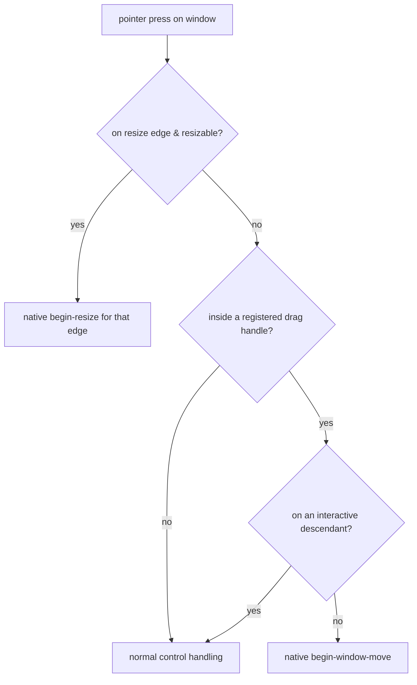

# feat: Custom-chrome windows

**Target repos:** C work lands in the libui-ng fork (`HelgeSverre/libui-ng@maintained`); binding work lands in this repo (`helgesverre/libui`). Paths below are repo-relative to whichever repo the unit targets, noted per unit.

## Summary

Add first-class custom-chrome windows: borderless windows where an app marks a control as the titlebar (drag handle), picks a corner-style preset, and toggles the drop shadow, while keeping resize / min-max and OS snap. Implement the C API across all three backends in the fork, surface it through the generator into a typed PHP `Window` facade, and rebuild `examples/palette.php` on the real API as the proof. Completes the surface opened by the v0.7.0 `uiAreaBeginUserWindowMove/Resize` work. (see origin: docs/brainstorms/2026-06-23-custom-chrome-windows-requirements.md)

## Problem Frame

libui windows are all-or-nothing — standard OS titlebar, or a bare borderless window with no move, no rounded corners, no shadow. Building a frameless app (the `palette.php` command-palette showcase) today means hand-wiring low-level Area mouse events and living with square, shadowless windows. The native capability exists on every platform; it just isn't exposed as a clean, consistent API.

## Requirements (trace to origin)

- **R1** custom-chrome capability via existing borderless · **R2** control-as-drag-handle (interactive children stay interactive) · **R3** multiple drag handles · **R4** corner preset enum `{None, Rounded, RoundedSmall}` · **R5** shadow toggle, default ON · **R6** resize + min/max via existing `uiWindowResizeable` · **R7** OS snap via correct hit-testing · **R8** low-level Area move/resize retained · **R9** graceful degradation + documented matrix · **R10** typed PHP `Window` facade · **R11** C API + enum through the generator.

## Key Technical Decisions

- **D1** Drag = control-as-handle (origin). C API references a child `uiControl`; backends translate to native drag on that control's view/widget/HWND-region.
- **D2** Corners = preset enum everywhere (origin). Windows maps 1:1 to DWM; macOS/GTK render matching radii (Rounded≈10px, RoundedSmall≈6px — exact values finalized in implementation).
- **D3** Extend borderless, no new window type (origin). Custom-chrome = `uiWindowSetBorderless(w, 1)` + the new setters.
- **D4** Degradation silent + documented matrix; no capability-query API in v1 (origin).
- **D5** Shadow defaults ON (origin).
- **D6** Keep low-level Area move/resize (origin).
- **D7 (plan)** Facade shape: `Window::setTitleBar(Control)`, `setCornerStyle(CornerStyle)`, `setShadow(bool)`; `CornerStyle` is a generated enum. Single titlebar setter in v1 (R3's "multiple handles" satisfied at the C level by allowing repeated registration, but the facade exposes one primary handle).
- **D8 (plan)** Fixed resize-grip width (a small constant, ~6px logical), not configurable in v1.
- **D9 (plan)** Sequence macOS → Windows → Linux → generator → facade → demo: macOS is locally compilable so it validates the C-API shape before the platforms that only compile on CI.

## High-Level Technical Design

**C API surface (in `ui.h`):**
```
typedef enum uiWindowCornerStyle {
    uiWindowCornerStyleNone, uiWindowCornerStyleRounded, uiWindowCornerStyleRoundedSmall
} uiWindowCornerStyle;

void uiWindowSetTitlebar(uiWindow *w, uiControl *handle);   // mark a child as the drag handle
uiWindowCornerStyle uiWindowCornerStyle(uiWindow *w);
void uiWindowSetCornerStyle(uiWindow *w, uiWindowCornerStyle style);
int  uiWindowShadow(uiWindow *w);
void uiWindowSetShadow(uiWindow *w, int shadow);
```
*(directional — exact names/signatures finalized in U1.)* Resize/min-max reuse `uiWindowSetResizeable`; borderless reuses `uiWindowSetBorderless`.

**Drag-handle hit-testing model (per platform):** the handle control's native bounds are the "caption" region; a press there that isn't on an interactive descendant initiates a native window-move; edges/corners (grip width D8) initiate native resize when the window is resizable.



**Corner/shadow → native mapping:**

| Concern | Windows | macOS | Linux/GTK |
|---|---|---|---|
| Corners | `DWMWA_WINDOW_CORNER_PREFERENCE` (Win11; older → square) | `contentView.layer.cornerRadius` + `masksToBounds` | window CSS `border-radius` (compositor-dependent) |
| Shadow | DWM frame extension on borderless | `[window setHasShadow:]` | CSS `box-shadow` (compositor-dependent) |
| Move | `WM_NCHITTEST`→`HTCAPTION` | `performWindowDragWithEvent:` | `gtk_window_begin_move_drag` |
| Resize | `WM_NCHITTEST`→`HTLEFT`/`HTBOTTOMRIGHT`/… | resizable styleMask | `gtk_window_begin_resize_drag` |

---

## Implementation Units

### U1. C API contract + macOS backend
**Target repo:** `HelgeSverre/libui-ng@maintained`
**Goal:** Define the full C API (R4/R11) in `ui.h` and implement it on Cocoa, validating the shape on the one locally-compilable platform.
**Requirements:** R1, R2, R3, R4, R5, R6, R8, D1–D8.
**Dependencies:** none (builds on existing borderless/resizeable + v0.7.0 Area methods).
**Files:** `ui.h`, `darwin/window.m`, `common/controlsigs.h` (if the signature table needs the new funcs), `darwin/uipriv_darwin.h` (if helpers needed).
**Approach:** add the `uiWindowCornerStyle` enum + setters/getters to `ui.h`. In `darwin/window.m`: corner-style via `contentView.layer.cornerRadius`/`masksToBounds`; shadow via `setHasShadow:` (default ON when borderless); titlebar via tracking the handle control's `NSView` and initiating `performWindowDragWithEvent:` on background mouse-down (skip when the hit subview is an `NSControl`). Resize reuses the resizable styleMask. Keep all new state on the `uiWindow` struct.
**Patterns to follow:** the existing `uiWindowSetBorderless`/`uiWindowResizeable` in `darwin/window.m`; the v0.7.0 `uiAreaBeginUserWindowMove` Cocoa path.
**Test scenarios:** macOS local build succeeds; a manual harness window: setCornerStyle(Rounded) rounds the window; setShadow(false) removes the shadow; dragging the marked handle moves the window; clicking a button *inside* the handle still fires the button; resize from an edge works. *(Behavioral checks are manual — no headless GUI test on macOS.)*
**Verification:** `meson setup && ninja` builds the dylib locally; manual visual check.

### U2. Windows backend
**Target repo:** `HelgeSverre/libui-ng@maintained`
**Goal:** Implement the U1 C API on Win32/DWM.
**Requirements:** R2, R4, R5, R6, R7, R9 (Win10 corner degradation).
**Dependencies:** U1 (C API contract).
**Files:** `windows/window.cpp`, `windows/winutil.cpp` (DWM helpers if needed).
**Approach:** corners via `DwmSetWindowAttribute(DWMWA_WINDOW_CORNER_PREFERENCE)` (dynamic-resolve for older SDK; Win10 → square, documented); shadow via DWM frame extension; drag + resize via `WM_NCHITTEST` returning `HTCAPTION` over the handle region (excluding interactive child rects) and `HTLEFT`/`HTBOTTOMRIGHT`/… over edges/corners within the grip width — Aero Snap then works for free (R7).
**Patterns to follow:** existing `windows/window.cpp` borderless handling; the color-emoji patch's dynamic `GetProcAddress` pattern (`windows/init.cpp`) for version-gated DWM calls.
**Test scenarios:** fork CI `Win-x64-static` / `Win-x86-static` / `Mingw-x64-static` compile green; *(manual visual confirmation deferred to a Windows user — corners/shadow/drag/resize/snap.)*
**Verification:** fork `build.yml` Windows jobs pass.

### U3. Linux/GTK backend
**Target repo:** `HelgeSverre/libui-ng@maintained`
**Goal:** Implement the U1 C API on GTK3 with graceful Wayland degradation (R9).
**Requirements:** R2, R4, R5, R6, R9.
**Files:** `unix/window.c`.
**Dependencies:** U1.
**Approach:** `gtk_window_set_decorated(FALSE)` for CSD; corners via window CSS `border-radius`, shadow via CSS `box-shadow` (best-effort, compositor-dependent); drag via `gtk_window_begin_move_drag` from a button-press on the handle widget; resize via `gtk_window_begin_resize_drag`. Where the compositor/Wayland can't honor corners/shadow/programmatic move, the window still functions (no error) — degradation documented in the support matrix.
**Patterns to follow:** existing `unix/window.c` borderless + the v0.7.0 Area move/resize GTK path.
**Test scenarios:** fork CI `Ubuntu-x64-shared` / `Ubuntu-x64-static` compile green; *(manual visual confirmation deferred to a Linux user; note expected degradation under Wayland.)*
**Verification:** fork `build.yml` Ubuntu jobs pass.

### U4. Generator pickup + regenerate
**Target repo:** `helgesverre/libui`
**Goal:** Make `tools/generate.php` emit the new `uiWindow*` functions and the `uiWindowCornerStyle` enum into `src/Generated/Window.php` + `src/Generated/Enum/`.
**Requirements:** R11.
**Dependencies:** U1 (header is the generator's input; pin `LIBUI_REF` to the fork commit).
**Files:** `tools/generate.php`, `tools/annotations.php` (only if the new funcs need an annotation, e.g. the corner enum classification or a bool func), regenerated `src/Generated/Window.php` + `src/Generated/Enum/WindowCornerStyle.php` + `stubs/FFI.php` + `src/Native/libui.gen.h`.
**Approach:** point the binding's `build-libui.sh` `LIBUI_REF` at the fork commit carrying U1–U3 (this is the fork-adoption seam — see Risks); run `composer regen`. The corner enum should be picked up by the existing enum generator; `uiWindowShadow`/`SetShadow` should fall under the existing bool-func handling (verify against `annotations.php` `bool_funcs`). `uiWindowSetTitlebar(uiWindow*, uiControl*)` follows the existing cross-control parameter handling.
**Test scenarios:** Covers R11. `composer regen` produces the new generated symbols and is idempotent (re-run = no diff); `composer gate` (FFI::cdef accepts the header) passes; generated `WindowCornerStyle` enum has the three cases with correct int values.
**Verification:** `composer regen` clean + `composer gate` green.

### U5. PHP `Window` facade
**Target repo:** `helgesverre/libui`
**Goal:** Hand-written ergonomic sugar over the generated API (R10, D7).
**Requirements:** R10, R2, R4, R5, D7, D8.
**Dependencies:** U4.
**Files:** `src/Window.php`, `tests/WindowChromeTest.php`.
**Approach:** add `setTitleBar(Control $c): static`, `setCornerStyle(WindowCornerStyle $style): static`, `setShadow(bool $on): static`, casting bool→int and enum→value, mirroring existing facade conventions (e.g. `setMargined`, `getContentSize`). Optionally a `Window::chromeless(...)` convenience that sets borderless + sensible chrome defaults. Document the Win10-square-corner and Wayland caveats in the method docblocks.
**Patterns to follow:** the v0.7.0 `getContentSize()`/`getPosition()` additions and the existing fluent setters in `src/Window.php`.
**Test scenarios:** Covers R10. `setTitleBar`/`setCornerStyle`/`setShadow` each return the same `Window` instance (fluent); constructing a chromeless window yields a non-null handle; enum round-trips (`cornerStyle()` returns what was set, where observable headlessly, else assert no-throw + type). PHPStan clean; no-op behavioral correctness deferred to manual (GUI).
**Verification:** `phpunit tests/WindowChromeTest.php` green; `composer stan` clean.

### U6. Showcase rebuild + docs
**Target repo:** `helgesverre/libui`
**Goal:** Prove the API by rebuilding the command-palette showcase on it, and document the feature.
**Requirements:** success criteria (origin).
**Dependencies:** U5.
**Files:** `examples/palette.php`, `docs/GUIDE.md`.
**Approach:** replace `palette.php`'s low-level Area-mouse window-drag wiring with `setTitleBar()` + borderless + `setCornerStyle(Rounded)` + shadow. Add a GUIDE section "Custom-chrome windows" with the API, the per-platform support matrix (R9), and the Win10/Wayland caveats.
**Test scenarios:** Test expectation: none — example + docs. Verification is the example running on macOS with the expected rounded, shadowed, draggable window.
**Verification:** `php examples/palette.php` runs on macOS and the window is borderless, rounded, shadowed, and draggable from the palette's top bar.

---

## Scope Boundaries

**In scope:** R1–R11 across the three backends + generator + facade + showcase.

**Deferred for later (origin):** window vibrancy/translucency (#1, the next roadmap item this chrome will host); webview (#6); arbitrary pixel corner radius + a capabilities-query API; custom snap/tiling beyond the OS.

**Outside this product's identity (origin):** not a general theming/CSS engine; not non-rectangular / per-pixel custom-shaped windows.

**Deferred to follow-up work:** none specific to this plan beyond the above.

---

## Risks & Dependencies

- **Fork-adoption seam (highest):** U4–U6 require the binding to consume the fork build carrying U1–U3 (rebuilt prebuilt libs + `LIBUI_REF` bump). This couples to the separately-flagged "adopt the fork as the binding's native base" decision. If that adoption hasn't happened, U1–U3 still land in the fork and U4–U6 can proceed against a locally-built lib, but shipping to binding users waits on the base migration.
- **Cross-platform verification asymmetry:** only macOS compiles + runs locally; Windows/Linux correctness is gated on the fork's `build.yml` CI (compile + libui test suite), with visual/behavioral confirmation deferred to platform users — same posture as the bug-fix batch already shipped.
- **DWM version gating:** `DWMWA_WINDOW_CORNER_PREFERENCE` is Win11; Win10 degrades to square corners (documented, R9). Resolve the API dynamically to keep the Vista-era SDK build compiling (mirror the color-emoji patch's `GetProcAddress` approach).
- **Wayland:** no programmatic positioning; corners/shadow compositor-governed → primary degradation surface (R9). The window must remain functional regardless.
- **Drag/interactive-child exclusion:** correctly distinguishing "drag the window" from "click a control inside the handle" is the subtlest cross-platform behavior; each backend handles it differently (subview-type check on macOS, child-rect exclusion in `WM_NCHITTEST` on Windows, widget event propagation on GTK).

## Verification Strategy

1. **macOS (local):** `ninja` build of the fork + manual visual check of the harness/`palette.php`.
2. **Windows + Linux (CI):** dispatch the fork `build.yml` on `maintained`; all 8 configs must compile + pass the libui test suite.
3. **Binding:** `composer regen` (clean/idempotent) + `composer gate` + `composer stan` + `phpunit` + `examples/palette.php` runs.
4. **Behavioral:** manual per-platform confirmation (drag from handle; nested controls click; corners + shadow render or degrade gracefully).

## Deferred Implementation Notes (execution-time)

- Exact corner-radius pixel values for Rounded/RoundedSmall on macOS/GTK (tune to visually match Win11 presets).
- Final names in `controlsigs.h` / whether `uiWindowSetTitlebar` needs an `On*`-style registration vs a plain setter.
- Whether `Window::chromeless()` convenience is worth shipping in v1 or deferred.
- Resize-grip width constant (D8) — pick after seeing real hit-testing behavior.
